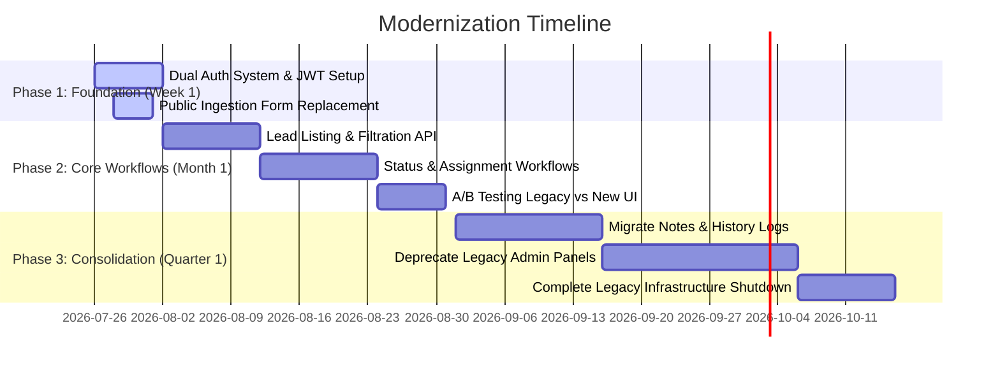

# Migration Plan: Phased Modernization Strategy

This migration plan outlines a phased transition from our legacy lead management codebase to the new modern full-stack implementation. To minimize system downtime and prevent operational disruptions, we explicitly reject a "Big Bang" rewrite in favor of an incremental strangler-fig pattern.

---

## Migration Philosophy: The Strangler Fig Pattern

1. **No Big Bang Rewrite**: We do not shut down the old system. Instead, we run the modern system alongside the legacy system, proxying requests gradually from the legacy router to the new API gateway.
2. **Database Coexistence**: The new system uses MongoDB. If the legacy system uses a relational database (e.g., MySQL), we will implement a dual-write mechanism or a change-data-capture (CDC) pipeline using Debezium or a lightweight script to sync data in real time until the cutover is complete.
3. **Feature-by-Feature Rollout**: We prioritize components based on their critical value and ease of migration, beginning with the authentication layer and lead ingestion forms.

---

## Timeline & Milestones

---

### Phase 1: Week 1 — Foundation & Security Cutover

- **Goal**: Implement the secure identity boundary and replace the highest-exposure public page.
- **Tasks**:
  1. **Deploy New Auth Service**: Deploy the Node.js/Express JWT authentication service. Set up the Mongoose database schemas for `User`.
  2. **Implement Gateway Routing**: Configure Nginx or our cloud router to intercept all `/api/auth` requests and route them to the new Express service. Legacy routes continue to point to the legacy server.
  3. **Launch New Public Lead Capture Form**: Build the new React/Vite-based public lead submission page. Update marketing links to point to this form. This form submits payloads to the new API endpoint `/api/leads/public` which dual-writes to the old SQL database and the new MongoDB cluster.

---

### Phase 2: Month 1 — Core Dashboards & Status Management

- **Goal**: Establish the central workspace for sales reps and administrators, moving them off legacy screens.
- **Tasks**:
  1. **Migrate Lead CRUD Services**: Expose the new `/api/leads` paginated, filtered, and searched endpoint.
  2. **Introduce Lead Assignment & Status Flows**: Build the new status pipeline (New -> Contacted -> Qualified -> Proposal Sent -> Won -> Lost) and lead assignment controls on the backend.
  3. **Deploy the Modern React Dashboard**: Release the unified dark dashboard interface. Users can log in using their new credentials. 
  4. **Run in Parallel**: Sales reps can use either dashboard. Any updates made in the new UI are instantly propagated back to the legacy database via background sync webhooks to ensure data parity.

---

### Phase 3: Quarter 1 — Complete Data Migration & Legacy Deprecation

- **Goal**: Transition historical logs, transition all administrative operations, and safely retire legacy services.
- **Tasks**:
  1. **Migrate Activity Logs & Notes**: Perform a one-time migration of historical note text and customer status history into the MongoDB collections.
  2. **Enforce Read-Only on Legacy UI**: Switch off input capabilities on legacy screens, redirecting users to the modern React application interface.
  3. **Final Database Cutover**: Decommission the dual-write sync scripts. Make the MongoDB cluster the sole source of truth.
  4. **Infrastructure Shutdown**: Deprecate legacy servers, reclaiming cloud computing resources and reducing operational overhead.
